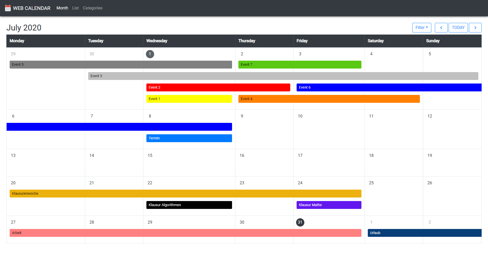

# Web Calendar

Visual representation of calendar backend service.

## Author
Max Ermackov - [MaxXLive](https://github.com/MaxXLive)

## Included Technologies
- HTML 5
- CSS 3
- Javascript (ECMAScript 2015) (Not Internet Explorer compatible)
- AJAX
#### External
- Bootstrap CSS + JS (https://getbootstrap.com/) (files in src/js/bootstrap and src/css/bootstrap)
- jQuery (required for some bootstrap functions)
- Google's Material Icon set (https://material.io/resources/icons)

## Local Setup
1. Unzip
2. Run `index.html`
3. Enjoy

## Compatibility

This website is fully compatible with:
- Google Chrome 84.0.4147 (primary)
- Mozilla Firefox

## Features
- Show calendar entries as list view and month view.

- Create calendar entry by either clicking on '+' button in list view or on a 'day bubble' in month view.

- Displaying details of entries by either clicking on an entry in list view or on an event in month view.

- It is possible to click (outside edit mode) on location, organizer and webpage to open it / send a mail.

- Added colors, which are visible in month view and when hovering over events in list view. Text color gets changed depending on background color brightness.

- Edit calendar entry by clicking the 'edit' button, when displaying details.

- It is disabled to select the end time / date before the start time / date.

- Delete calendar entry by clicking the 'delete' button, when displaying details and confirming.

- Image for calendar entry can be seen as a preview on top when displaying details. To see the hole image just hover over it.

- To add/set an image, click on the image preview or drag a file into it while in edit mode.

- Click save to save the changes made. Click the close button or press the escape key to discard all changes. Clicking outside the dialog is disabled due to else easy loss of changes.

- In month view, the current month can be switch by either clicking the '<' and '>' buttons on the top right of the page or by pressing the arrow left / right keys.

- In month view, a dark gray bubble marks today's date. It can be reached by clicking 'TODAY' in the top right corner.

- In month view, events are displayed by blue entries. If those remain multiple days, they extend up to the end day. Overlapping events get positioned dynamically, as seen in the screenshot.

- In month view, events can be filtered by their categories. For that, click the 'Filter' button in the top right corner and select the desired category.

- In month view, the first day (to prevent false inputs) of an event can be moved by using drag and drop. The cell into which it is dropped will become the start date. Keep in mind that in firefox only the text inside can be dragged!

- Categories can be added while editing / adding events. Just type in the name of the new category in the bottom of the dropdown window and press '+', or the enter key.

- Categories can be deleted in the category view. Adding from there is also possible.

- Deletion confirmation dialogs (event and category can be accepted with the enter key as well).
